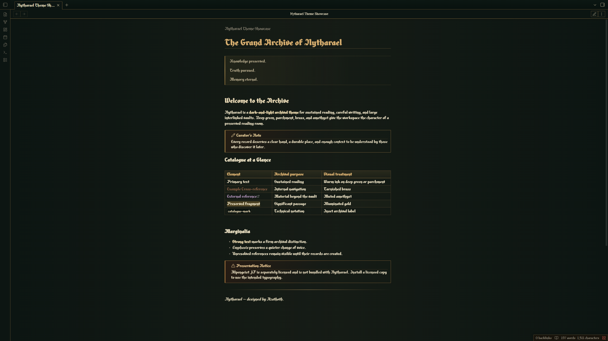

# Nytharael

Nytharael is a dark-and-light archival theme for sustained reading, careful writing, and large interlinked vaults. Deep green, parchment, brass, and amethyst give the workspace the character of a preserved reading room.

## Features

- Dark reading-room and light parchment modes
- Warm, high-contrast long-form typography
- Cohesive reading and Live Preview experiences
- Archival treatments for headings, links, tables, properties, callouts, code, and blockquotes
- Styled workspace navigation, settings, prompts, menus, notices, and hover previews
- Integrated Graph and Canvas presentation
- Restrained interaction and selection states designed for large vaults

## Typography and Alpengeist JF

Nytharael is designed around **Alpengeist JF**, a commercial typeface published by Jukebox Type. The font is not included with this theme and is not covered by this repository's MIT License.

Install a separately licensed copy of Alpengeist JF on your operating system to use the intended typography. When it is unavailable, Nytharael falls back to the system serif family.

No payment is required to install or use Nytharael itself.

## Installation

### Community Themes

After publication, open **Settings → Appearance → Themes → Manage**, search for **Nytharael**, and select **Install and use**.

### Manual installation

1. Create `<vault>/.obsidian/themes/Nytharael/`.
2. Copy `manifest.json` and `theme.css` into that folder.
3. Open **Settings → Appearance** and select **Nytharael** under Themes.

## Compatibility

- Requires Obsidian 1.13.7 or newer
- Supports dark and light modes
- Tested on Obsidian Desktop for Windows
- Mobile is currently untested and is not a compatibility commitment for version 1.0.0

## Privacy and network use

Nytharael contains no telemetry, advertisements, remote imports, or network-loaded assets. It does not require an account or access files outside the vault.

## License

Nytharael's theme source is released under the [MIT License](./LICENSE). Alpengeist JF and any other separately installed fonts remain subject to their respective licenses.

Copyright © 2026 Azathøth.
